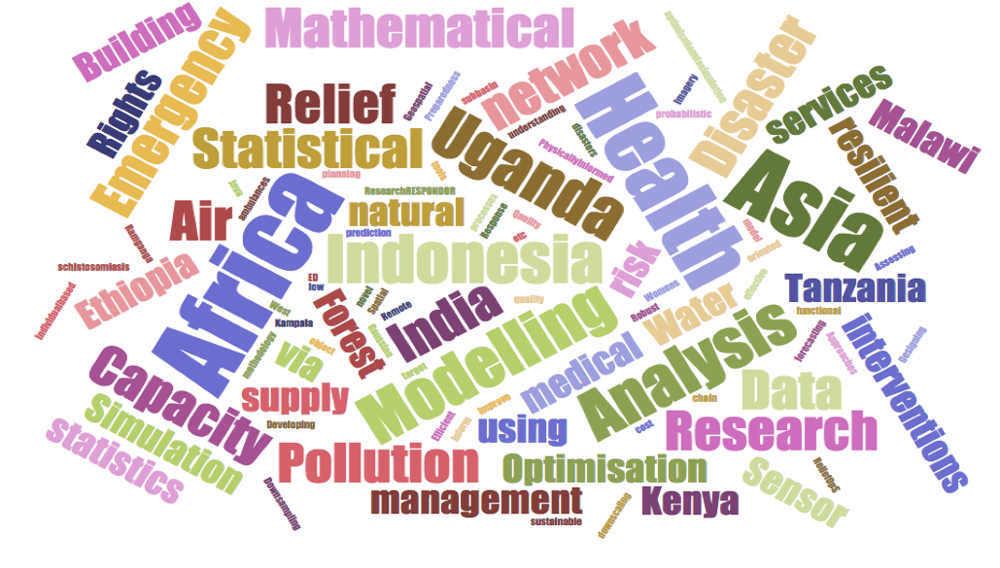

# Future directions: Mathematical Science Community and GCRF initiatives:
# Dates: 
19th October 2020 -- 21st October 2020

# Venue: 

ICMS, Edinburgh - virtual workshop

{:height="200px"} |
{:height="200px"}

# Workshop Goals

This strategic workshop seeks to achieve two primary goals: (1) to provide a much-needed venue for interaction among both established and early career researchers from the Mathematical Sciences community to identify new global challenges arising in LMIC countries, propose novel mathematical and statistical solutions to these challenges, thereby  setting the foundation for establishing long-term and fruitful collaborative groups who will be able to compete for larger open GCRF call; (2) to provide a forum to develop  synergies among currently funded (2019/2020 start dates) EPSRC-GCFR grants focused on the disciplinary theme of  “Tackling global development challenges through mathematical sciences” or  “Building capacity to tackle global development challenges through mathematical sciences research.”
Building cross-connections throughout the workshop, through the exchange of statistical and mathematical ideas, techniques and tools previously limited in a single area-- the end-goal will be to consolidate these into a novel synthesis of methodologies leading to new breakthroughs in solving scientific problems from a multi-pronged and multi-disciplinary mathematical and statistical perspective. Along with the consolidation based on application areas, participants at the workshop will also explore possibilities of consolidation based on 

1.	Geographical focus (e.g. Africa, India, SE Asia)
2.	Mathematical and Statistical Methodology proposed to solve LMIC problems.

# Organizers

* Ray, Dr S (primary contact)	University of Glasgow
* Schönlieb, Professor C-B.	University of Cambridge
* Dryden, Professor IL	University of Nottingham
* Harper, Professor PR	Cardiff University
* Wilkinson, Professor RD	University of Sheffield
* Zografos, Professor K	Lancaster University
* Prada, Dr JM	University of Surrey
* Giorgi, Dr E	Lancaster University
* Madzvamuse, Professor A	University of Sussex
* Szendroi, Professor B	University of Oxford
* Faraway, Professor JJ	University of Bath
* Trotter, Dr CL	University of Cambridge
* Scaparra, Professor MP	University of Kent

# Tentative Program

> ## Day 1 (19.10.2020)
> 
> ### Session 1 (9:30-11:00) 
>   - Welcome 
>   - External speaker 1
>   
> ### Session 2 (11:15-12:30)
>   - Updates from research grant
>   
> 
> ### Session 3 (14:00-15:30)
>   - Discussion Break out session
>   	- By region?
> 
> 
> 
> ## Day 2 (20.10.2020)
> ### Session 1 (9:30-11:00)
> - Updates from capacity building grants
>   
> ### Session 2 (11:15-12:30)
>   - External speaker 2
>   - External speaker 3
> 
> 
>  
> ### Session 3 (14:00-15:30)
>  - Discussion Break out session
>   	- By methods?
> 
> 
> 
> ## Day 3 (21.10.2020)
> ### Session 1 (9:30-11:00)
>   - External speaker 4
>   - External speaker 5
>   - External speaker 6
> 
>      
> ### Session 2 (11:15-12:30)
>    - Discussion idenitifying future grants
>    
> ### Session 3 (14:00-15:30)
>    - Conclusion and future plans

Identified Themes:
==================

*   Area 1 - Air pollution
 
*   Area 2 - Emergency Management
 
*   Area 3 - Water Quality

*   Area 4 - Public Health and Infectious diseases

Identified Regions:
===================

-   Africa,

-   India,

-   SE Asia

-   South America?

